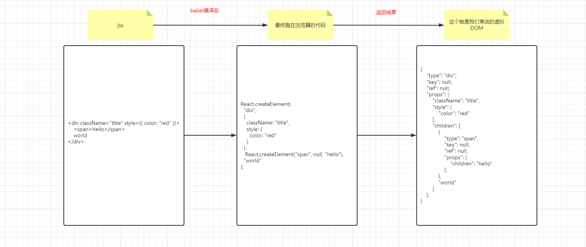
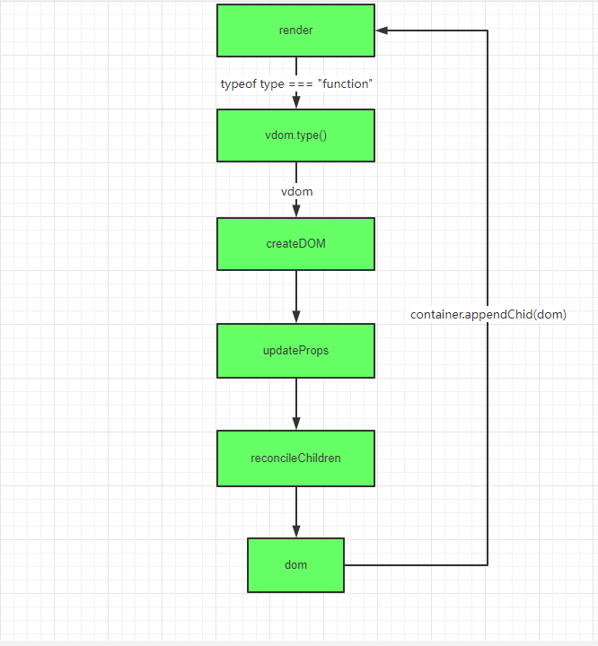
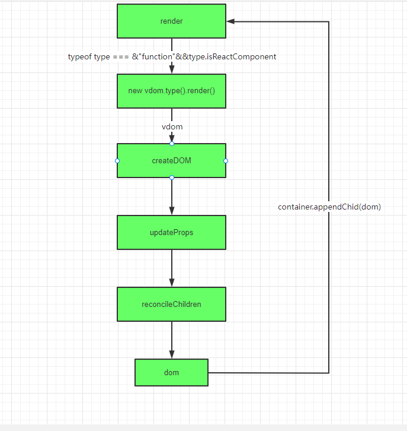

# min-react

从0-1实现简易版的react，涉及函数组件，类组件、hooks、组件更新、合成事件批量更新、生命周期等等。

## 一、jsx 渲染

### 1.1 什么是JSX

- JSX是一种JS和HTML混合的语法，将组件的结构、数据甚至样式都聚合在一起的写法，运用于React架构中，其格式比较像是模版语言，但事实上完全是在JavaScript内部实现的。元素是构成React应用的最小单位，JSX就是用来声明React当中的元素，React使用JSX来描述用户界面

### 1.2 什么是元素

- JSX其实只是一种语法糖,最终会通过[babeljs](https://www.babeljs.cn/repl)转译成React.createElement语法

- `React.createElement`会返回一个React元素

- React元素事实上是普通的JS对象，用来描述你在屏幕上看到的内容

- `ReactDOM`来确保浏览器中的真实DOM数据和React元素保持一致

  

## 二、组件

- 可以将UI切分成一些独立的、可复用的组件，这样你就只需专注于构建每一个单独的部件
- 组件从概念上类似于 `JavaScript` 函数。它接受任意的入参(props属性)，并返回用于描述页面展示内容的 React 元素
- react采用组件化的思想，最小的组件单位就是原生HTML元素，采用JSX语法组件声明调用
- react的虚拟dom，就是一个大的组件树，从父组件层到子组件，在react-router v4版开始，路由本身也是组件
- 各个库提供的hoc返回也是组件，如withRouter、connect
- react中的基础数据state props的传递也是以组件为基础

总结：在React中，一切皆为组件 

### 2.1、函数式组件

- 函数组件接收一个单一的props对象并返回了一个React元素
- 组件名称必须以大写字母开头
- 组件必须在使用的时候定义或引用它
- 组件的返回值只能有一个根元素
- React元素不但可以是DOM标签，还可以是用户自定义的组件
- 当 React 元素为用户自定义组件时，它会将 JSX 所接收的属性（attributes）转换为单个对象传递给组件，这个对象被称之为`props`

### 2.2、类组件

- 类组件的渲染是根据属性创建类的实例，并调用实例的render方法返回一个React元素

### 2.3、类组件的更新

#### 2.3.1、组件状态

- 组件的数据来源有两个地方，分别是属性对象和状态对象
- 属性是父组件传递过来的
- 状态是自己内部的,改变状态唯一的方式就是`setState`
- 属性和状态的变化都会影响视图更新
- 不要直接修改 State，构造函数是唯一可以给 this.state 赋值的地方